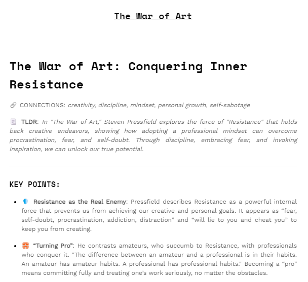
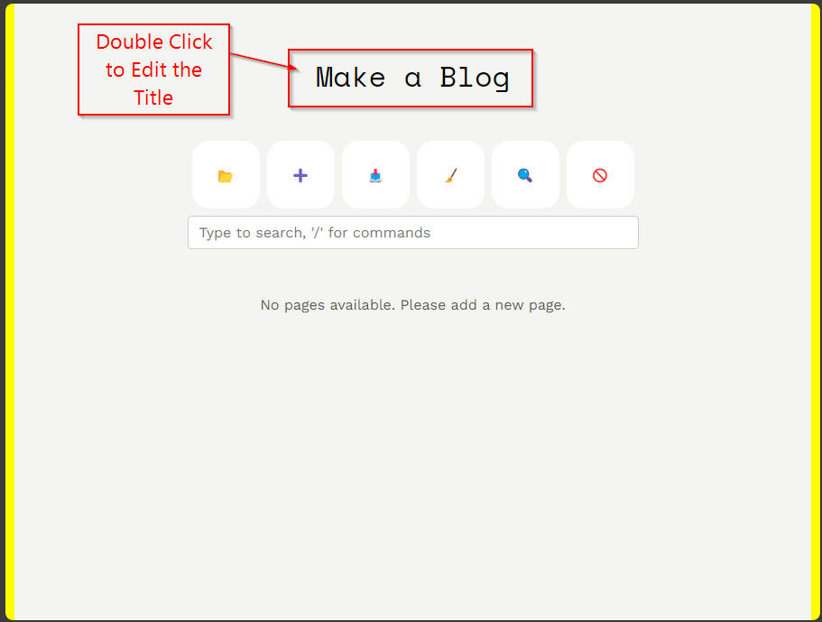
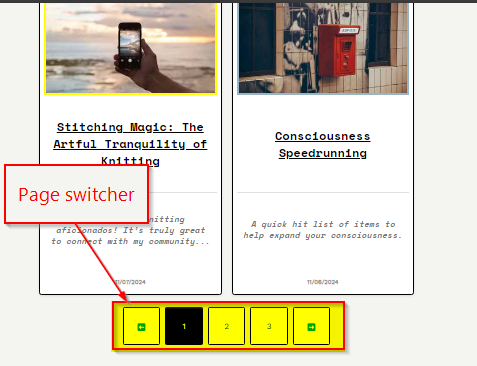

# MiniBlog Admin - Post Builder

Welcome to **MiniBlog Admin**, an intuitive web application designed for creating, managing, and exporting your blog posts. This admin tool allows you to draft and organize your content efficiently. Once your posts are ready, you can export them as a JSON file and upload it wherever you want them to be loaded from, integrating seamlessly with your MiniBlog front-end or any other platform.

Access the live application here: [**MiniBlog Admin Live Demo**](https://garbledhamster.github.io/MiniBlog/)

---

## Table of Contents

- [Features](#features)
- [Screenshots](#screenshots)
- [Usage](#usage)
  - [Adding a New Post](#adding-a-new-post)
  - [Editing a Post](#editing-a-post)
  - [Deleting a Post](#deleting-a-post)
  - [Exporting Posts](#exporting-posts)
  - [Importing Posts](#importing-posts)
  - [Using Commands](#using-commands)
  - [Customizing Appearance](#customizing-appearance)
  - [Clearing Data](#clearing-data)
- [Detailed Functionality](#detailed-functionality)
  - [Editable Blog Title](#editable-blog-title)
  - [Command Autocomplete](#command-autocomplete)
  - [Internal Linking in Posts](#internal-linking-in-posts)
  - [Pagination and Sorting](#pagination-and-sorting)
  - [Markdown Support](#markdown-support)
  - [Local Storage Management](#local-storage-management)
  - [OpenAI API Integration](#openai-api-integration)
- [License](#license)

---

## Features

- **Create, Edit, and Delete Posts**
  - Manage your blog posts with an easy-to-use interface tailored for drafting content.

- **Export and Import JSON**
  - Export your drafts and posts as a JSON file to be uploaded wherever you want them to be loaded from.

- **Markdown Support**
  - Write rich content using Markdown for formatting.

- **Command Input with Autocomplete**
  - Use intuitive commands to streamline your workflow.

- **Search and Navigate Posts**
  - Quickly find posts or navigate using the built-in search functionality.

- **Customizable Appearance**
  - Use the color picker to style your posts’ frames and adjust the interface to your liking.

---

## Screenshots

### Home Page


---

### Add Post Button


---

### Add Post Form


---

### Post Body Example


---

### Edit and Delete Post Buttons


---

### Export JSON Button


---

### Import JSON Button


---

### Command Input Autocomplete


---

### Color Picker for Frames


---

## Usage

### Adding a New Post

1. **Click the "Add Post" Button**
   - On the main interface, locate the control panel at the top. Click the **➕** (Add New Post) button to open the add post form.

     

2. **Fill Out the Form**
   - In the **Add New Post** form, provide the following details:
     - **Picture URL (optional):** Enter the URL of an image to associate with your post. If left blank, a default or placeholder image will be used.
     - **Background Color:** Use the color picker to choose a background color for the image container.
     - **Title:** Enter a descriptive title for your post.
     - **Description:** Write a brief summary or introduction.
     - **Date:** Specify the date. Defaults to today's date if left blank.
     - **Body:** Compose your post content using Markdown syntax for formatting.

     

3. **Save the Post**
   - Once all fields are filled, click the **💾** (Save) button to add the post to your drafts. Your post will now appear in the list of posts.

---

### Editing a Post

1. **Locate the Post**
   - Scroll through the **Latest Grid** to find the post you wish to edit.

2. **Click the Edit Button**
   - On the post card, click the **✏️** (Edit) button to open the edit form.

     

3. **Modify the Details**
   - Update any of the post details in the form that appears. You can change the image, title, description, date, or body content.

     

4. **Save Your Changes**
   - Click the **💾** (Save) button to apply your changes.

---

### Deleting a Post

1. **Locate the Post**
   - Find the post you want to remove in the **Latest Grid**.

2. **Click the Delete Button**
   - Click the **🗑️** (Delete) button on the post card.

     

3. **Confirm Deletion**
   - A confirmation dialog will appear. Click **OK** to confirm and delete the post.

---

### Exporting Posts

Once you have drafted your posts and are ready to publish them:

1. **Click the Export Button**
   - In the control panel at the top, click the **📥** (Export JSON) button to save your blog data.

     

2. **Download the JSON File**
   - A JSON file containing your posts will be downloaded to your device.

3. **Upload the JSON File**
   - You can now upload this JSON file to wherever you want your posts to be loaded from. This could be your MiniBlog front-end, a server, or any platform that consumes the JSON data.

---

### Importing Posts

If you have a JSON file of posts (e.g., from a previous export or another source), you can import it into the admin tool:

1. **Click the Import Button**
   - Click the **📂** (Load JSON) button in the control panel.

     

2. **Select the JSON File**
   - Choose the JSON file containing the posts you wish to import.

3. **Load the Data**
   - The posts from the file will be loaded into the application, and will appear in the **Latest Grid** for further editing or exporting.

---

### Using Commands

The command input allows you to perform actions quickly using slash commands.

1. **Access the Command Input**
   - Locate the command input field in the control panel.

2. **Type a Command**
   - Start by typing `/` to see available commands. As you type, an autocomplete suggestion box will appear.

     

3. **Select a Command**
   - Use the arrow keys to navigate the suggestions and press **Enter** to select.

4. **Execute the Command**
   - Follow the command syntax to execute actions like creating posts or saving API keys.

---

### Customizing Appearance

1. **Adjust Frame Colors**
   - Use the color picker in the add/edit form to change the background color of the image container for each post.

     

2. **Zoom and Sort**
   - **Zoom:** Click the **🔍** (Zoom) button to cycle through zoom levels (75%, 100%, 125%, 150%).
   - **Sort:** Click the **🚫** (Sort) button to sort posts by date, name, or color.

     

---

### Clearing Data

1. **Click the Clear Button**
   - If you wish to reset the application or start over, click the **🧹** (Clear All) button in the control panel.

     

2. **Confirm Clearing**
   - A confirmation dialog will appear. Click **OK** to clear all data from local storage.

---

## Detailed Functionality

### Editable Blog Title

- **Inline Editing**
  - Double-click on the main blog title at the top to edit it. After editing, press **Enter** or click outside the input field to save the new title.

    

- **Local Storage Sync**
  - The blog title is saved in local storage and persists across sessions.

### Command Autocomplete

- **Accessing Commands**
  - In the command input field, type `/` to initiate command autocomplete.

    

- **Available Commands**
  - `/createpost 'Your Title Here'`
    - Creates a new post with the specified title.
  - `/generatepost 'Your Prompt Here'`
    - Generates a post based on the provided prompt using OpenAI's API.
  - `/saveapikey 'Your_API_Key_Here'`
    - Saves your OpenAI API key for content generation.
  - `/clearapikey`
    - Clears the saved OpenAI API key.

- **Autocomplete Navigation**
  - Use arrow keys to navigate suggestions and press **Enter** to select.

### Internal Linking in Posts

- **Body Textarea Autocomplete**
  - When editing the body of a post, typing `[[` triggers an autocomplete for existing post titles.

    

- **Insert Links**
  - Select a post from the suggestions to insert a link in the format `[[Post Title]]`. This creates an internal link to another post.

- **Backlinks (Shift Key)**
  - Holding the **Shift** key while selecting a suggestion creates a mutual backlink between the current post and the selected one, facilitating easy navigation between related content.

### Pagination and Sorting

- **Pagination Controls**
  - Navigate between pages of posts using the pagination buttons at the bottom of the **Latest Grid**.

    

- **Sorting Options**
  - **No Sorting (Default):** Posts are displayed in the order they were added.
  - **Sort by Date:** Click the sort button until the **🗓️** icon appears.
  - **Sort by Name:** Click until the **🔡** icon appears.
  - **Sort by Color:** Click until the **🎨** icon appears.

### Markdown Support

- **Markdown Syntax**
  - Use Markdown to format your post content. This includes headers, lists, bold, italics, links, images, code blocks, and more.

- **Previewing Content**
  - The body content is rendered using Markdown, allowing you to see how your formatted text will appear.

### Local Storage Management

- **Data Persistence**
  - All your posts and settings are stored in your browser's local storage, ensuring data is retained between sessions.

- **Data Clearing**
  - Use the **🧹** (Clear All) button to remove all stored data if needed.

- **Storage Info**
  - The application displays storage usage information at the bottom, helping you manage your local storage effectively.

### OpenAI API Integration

- **Content Generation**
  - Use the `/generatepost 'Your Prompt Here'` command to generate post content using OpenAI's API.

    - **Example:**
      ```
      /generatepost 'Write a blog post about the benefits of remote work.'
      ```

- **API Key Management**
  - **Save API Key:**
    - Save your OpenAI API key using the command:
      ```
      /saveapikey 'sk-your_api_key_here'
      ```
  - **Clear API Key:**
    - Remove the saved API key with:
      ```
      /clearapikey
      ```
  - **Security Note:**
    - Your API key is stored in local storage and used only within your browser. Ensure you trust the environment before saving sensitive information.

- **Error Handling**
  - The application provides feedback if there's an error during content generation, such as invalid API keys or network issues.

---

## License

MiniBlog Admin is licensed under the [MIT License](LICENSE).

*Made with ❤️ by [Joseph R](https://github.com/garbledhamster)*

---
